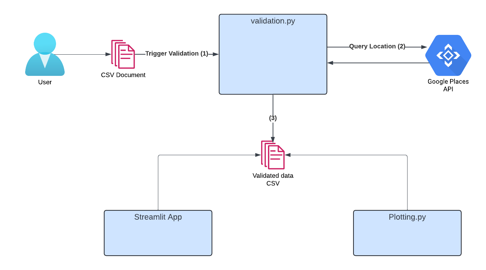

# Health Facility Validation and Data Analysis Tool
## Description

 - Reads longitude and latitude values in CSV file
 - Uses Google Places API to verify given coordinates
 - Generates new CSV file containing all data, labeling each piece of data as accurate or inaccurate
 - Using Streamlit tools, data is displayed in multiple forms at https://sylvestertb-ghana-insurance-streamlit-test-p0z9iz.streamlit.app/
 - Website is secured by usename and password, to view use username: **sbroich** password: **abc123**
